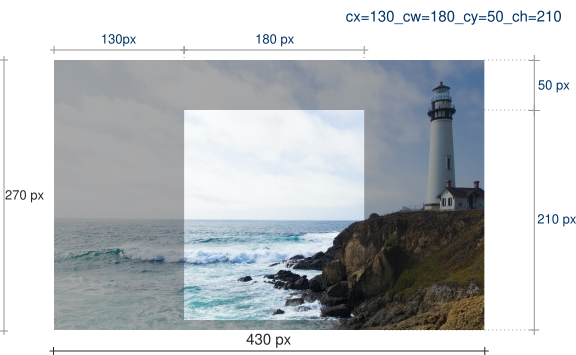

# ♻️ Transformations

Our routing logic expects the transformation part to come right before the target image hostname. This part of the variation url will be translated -under the hood- to searchParams as expected by [images.weserv.nl API](https://images.weserv.nl/). 

e.g resize to 150x150

```html
https://resizer.pictures/w=150_h=150/riff.one/images/designcue-unsplash.jpg
```

<ShowCase>
<template v-slot:first_paragraph>
Except for the very first time they are requested (and inmediately cached), variations will answer from the edge at blazing speed, and will even survive for a few months if the original image is deleted. The image to the right doesn't exist but in Cloudflare's Cache.
</template>
<template v-slot:second_paragraph>The response headers will also hint the browser not to request this same asset for a year. While this isn't much of a feature, your browser will hopefully not need requesting it anytime soon and that will shave a couple of ms off.

</template>
<template v-slot:table>

 | w=150 h=150 |
|----------|
|

</template>
</ShowCase>

----

In this section we enumerate supported transformations such as resizing, optimizing, compression, changing format, cropping and changing hue. Other transformations can be passed directly as searchParams to the variation URL (not ideal, but :shrug:)

----------
## Available Transformations


### Width and Height


-    w: [🔗 Width](https://images.weserv.nl/docs/size.html#width),
-    h: [🔗 Height](https://images.weserv.nl/docs/size.html#height)
- dpr: [🔗 Device Pixel Ratio](https://images.weserv.nl/docs/size.html#device-pixel-ratio)

```html
https://resizer.pictures/w=150_h=150/riff.one/images/dice.png
```

| dpr=2 w=200 l=0 | dpr=4 w=200 | dpr=2 w=200   | dpr=4 w=200 |
|----------|------|---------|  --  |
| | |    |   |  


### Fit/Colorize/Sharpen

 - fit: [🔗 Fit](https://images.weserv.nl/docs/fit.html) (contain, cover, inside, outside, fill)
 - bg: [🔗 Background Color](https://images.weserv.nl/docs/adjustment.html#background) (eg  fit=contain&cbg=0f0)
 - cbg: Background Color for Fit=Contain (eg  fit=contain&cbg=0f0)
 - hue: [🔗 Hue Rotation (0 to 360) ](https://images.weserv.nl/docs/adjustment.html#hue-rotation)
 - sharp: [🔗 Sharpen](https://images.weserv.nl/docs/adjustment.html#sharpen)
 - blur: [ Blur](https://images.weserv.nl/docs/adjustment.html#blur)
 - flip: [Flip](https://images.weserv.nl/docs/adjustment.html#flip)
 - flop: [Flop](https://images.weserv.nl/docs/adjustment.html#flop)
 - ro: [Rotate](https://images.weserv.nl/docs/adjustment.html#rotate)
 - con: [Contrast](https://images.weserv.nl/docs/adjustment.html#contrast)
 - filt: [Filter](https://images.weserv.nl/docs/adjustment.html#filter)
 - trim: [Trim](https://images.weserv.nl/docs/adjustment.html#trim) 

| |   |   |
|----------|------|---------|  
| <image-transform transform="w=200_hue=160">Hue</image-transform> | <image-transform transform="w=200_blur=2">Hue</image-transform> | <image-transform transform="w=200_sharp=3">Hue</image-transform> |
| <image-transform transform="w=200_con=3">Contrast</image-transform> | <image-transform transform="w=200_con=3">Contrast</image-transform> | <image-transform transform="w=200_con=3">Contrast</image-transform> | 

| w=100 hue=160 | w=160 h=100 cbg=green |  w=150 h=100 fit=cover sharp=4  |
|----------|------|---------|  
| | |   |  

### Pages and Frames

- n: [Number of Pages](https://images.weserv.nl/docs/format.html#number-of-pages) 
- page: [Page](https://images.weserv.nl/docs/format.html#page)

Use the `n` parameter to limit output to the first n  pages on a PDF 


| original PDF: 3 pages  |  n=2 (first two pages) |n=1 (only page 1) |
|----------|------|---------|
| | |   |     

Likewise, use it to limit to the first n frames in an animation 

| original 24 frames | limit to 6 frames | 3 frames | wtf is this? (page=2) |
|----------|------|---------|   -- |
| | |  | |

The `page` parameter is used to pick a particular resolution on a multi resolution .ico (however it had a weird effect in the pig above)

| 72x72 | 96x96 | 128x128 |
|----------|------|---------|  
| | |  |  


| page=1 | page=2 | page=3 |
|----------|------|---------|  
| ||  |  


 ### Compression/Optimization

- af: [Adaptative Filter](https://images.weserv.nl/docs/format.html#adaptive-filter) (only works on *png*)
- l: [Compression Level](https://images.weserv.nl/docs/format.html#compression-level) (number between 0 and 9. Only works on *png*, default 6)
- q: [Quality](https://images.weserv.nl/docs/format.html#quality) (only works on *jpg*, *tiff* and *webp*. number between 0 and 100, default 80)
- il: [Interlaced/Progressive](https://images.weserv.nl/docs/format.html#interlace-progressive)


| dpr=2 w=200 l=0 | dpr=2 w=200 l=6 af | dpr=2 w=200 q=100   | dpr=2 w=200 q=5 il |
|----------|------|---------|  --  |
| png 481kB | png 102kB | jpg 148kB| jpg 3.8kB  |
| | |    |   |  


### Output Format and naming

- output: [Output](https://images.weserv.nl/docs/format.html#output)
- filename: [Filename](https://images.weserv.nl/docs/format.html#filename)

```html
https://resizer.pictures/w=150_output=gif/riff.one/images/designcue-unsplash.jpg
```

| Original (png) | JPEG |   GIF   | WEBP |
|----------|------|---------|  --  |
| | |   |   |  


### Crop

[Cropping](https://images.weserv.nl/docs/crop.html#rectangle-crop) is achieved through 4 parameters

-  cw: 'Crop width',
-  cy: 'Crop y',
-  cx: 'Crop x',
-  ch: 'Crop height',

This one is tricky to get right, but you can see an example on the story of [my use case](use_cases.md). 

| original w=200 h=150 | w=200 h=150 | w=200 h=150 |  w=400 h=300  |
|----------|------|---------|  --  |
|  | cx=20 cy=20 fit=cover| cx=20 cy=20 ch=54 fit=cover| cx=82 cy=67 ch=137 cw=224 fit=cover|
| | |    |   |  

Basically, taking the image AFTER any resizing, you define a rectangle of [cw] x [ch] pixels, starting from a top left corner located at [cx, cy]. 

In the example below, the original image is resized to 430 x 270. From this size we want, in turn, to crop a 180 x 210 rectangle starting from [130, 50].



Depending on the `fit` parameter, a transformation `cx=130_cy=50_cw=180_ch=210` would yield 

--------------


